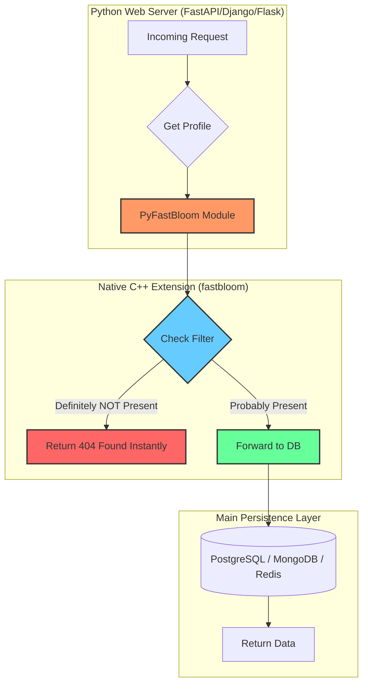

# PyFastBloom: Hyper-Efficient Thread-Safe C++ Bloom Filter 

[](https://isocpp.org/)
[](https://pybind11.readthedocs.io/)
[](LICENSE)

**PyFastBloom** is a high-performance, memory-optimized, thread-safe Bloom Filter implemented as a native C++ extension for Python. It is designed to handle millions of concurrent requests with microsecond latency.

---

##  The Problem: The "Missing Key" Database Penalty

In high-traffic systems, querying a database for a non-existent key (a "404 Not Found" case) is surprisingly expensive. 
1. **Disk I/O Bottleneck**: Databases often store indexes on disk. A request for a missing key forces the database to scan indexes/files, wasting valuable I/O cycles.
2. **Resource Exhaustion**: During a DDoS attack or a massive traffic spike, these useless disk reads can saturate the database, causing it to crash even if the data doesn't exist.
3. **Python GIL Limitations**: Implementing a massive concurrent data structure in pure Python is inefficient due to dynamic typing memory overhead and the Global Interpreter Lock (GIL), which prevents true hardware-level multithreading.

---

##  The Solution: Bare-Metal Performance

PyFastBloom solves these problems by providing an in-memory, probabilistic data structure that sits in RAM and instantly filters out non-existent keys before they ever hit the database.

### 1. Bare-Metal Memory Layer (C++)
- **Bit Packing**: Uses `std::vector<bool>` to pack 8 bits into a single byte, minimizing memory footprint.
- **Kirsch-Mitzenmacher Optimization**: Generates $k$ hash values using only two base hashes through the formula: $h_i(x) = (h_1(x) + i \cdot h_2(x)) \pmod m$. This allows for multiple hash lookups with minimal CPU overhead.

### 2. Concurrency Engine
- **RW-Locks**: Implements a Reader-Writer Lock using `std::shared_mutex`.
- **High Throughput**: Allows thousands of simultaneous `contains()` checks (shared locks) while ensuring thread-safety during `add()` operations (unique locks).

### 3. Native Language Bridge
- **pybind11**: Creates zero-copy bindings between C++ and Python.
- **Seamless Integration**: To the Python developer, it looks and feels like a standard library module but runs at C++ speeds.

---

##  System Architecture



---

##  Installation & Usage

### Build from Source
Ensure you have a C++17 compatible compiler and `pybind11` installed.

```bash
# Install build dependency
python3 -m pip install pybind11

# Build and install the extension
python3 -m pip install .
```

### Basic Usage

```python
import fastbloom

# Initialize: 10M bits, 7 hash functions
bf = fastbloom.BloomFilter(10 * 1024 * 1024, 7)

# Add a key
bf.add("user_id_12345")

# Check membership
if not bf.contains("user_id_12345"):
    # This block is NEVER reached for added keys
    pass

if bf.contains("unknown_user"):
    # This might be a false positive (very low probability)
    # Go to database
    pass
else:
    # Guaranteed that the user does NOT exist!
    # No database query needed. 
    print("Skipping DB - User definitely not found.")
```

---

## Technical Performance

| Feature | PyFastBloom (C++) | Pure Python Implementation |
|---------|-------------------|---------------------------|
| **Memory Efficiency** | High (Bit-packed `std::vector<bool>`) | Low (Object overhead) |
| **Concurrency** | True Hardware Multithreading (`shared_mutex`) | Limited by GIL |
| **Speed** | 10x - 50x Faster | Base overhead of interpreter |
| **Hashing** | Kirsch-Mitzenmacher optimized | Repeated hash calls |

---

##  Limitations & Considerations

- **Probabilistic**: Can return False Positives (says "Exists" when it doesn't). It NEVER returns False Negatives (says "Doesn't exist" when it does).
- **Fixed Size**: The size `m` and number of hashes `k` must be determined at initialization based on your expected capacity and desired error rate.
- **Non-Deletable**: Standard Bloom Filters do not support deletions. Once a bit is set to 1, it stays 1.

---


